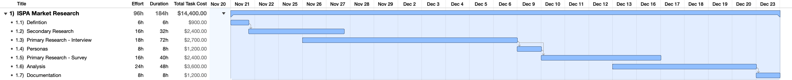

# SOW: Market Research

| | |
|:--|:--|
| Client | Rawls Group |
| Contractor | Netspective |
| Date Submitted | 11/20/2024 |
| Expiry Date | 12/04/2024 |

## Project Objectives

* Define objectives Rawls wants achieved 
* Scope objectives to fit within time and dollar budgets

Information needed from Rawls:
* Tactical questions Rawls wants answered
* Actions/Decisions Rawls wants supported
* Provisional KPIs Rawls intends for ISPA
* Mailing list for survey distribution 

## Outcome

* To improve Rawls’ strategic decision making for IPSA market position, with insights into market, demand, competition and pricing guidance.

## Scope

Conducting primary and secondary market research, and delivering insights derived from it.

## Deliverables 

### Market

* Estimate market size and scale in terms of number of participants and aggregate value.
	* TAM (total addressable market)
	* SAM (serviceable available market)
	* SOM (serviceable obtainable market)
* Segment market participants
	* By purchasing behaviour
	* Rawls to prioritize segments
		* Priority segment for ISPA membership
		* Priority segment for research (these may be different)

### Demand

* For each segment, identify
	* Motivations
	* Opportunities 
	* Needs
	* Challenges
* Estimate dollar values for each
* These focus on the the drivers behind purchasing behaviour, rather than the purchasing behaviour itself

### Competition

* Inventory direct and indirect market competitors
* Relate competitors to each other in the context of industry membership and supporting tools

### Pricing Guidance

* Use prices for analogous market services to help estimate pricing range for ISPA membership, including potential tiered pricing

## Level Of Effort Estimation

### Project Plan

### Itemization

| Stage | Effort | Duration | Cost |
|:--|:--|:--|--:|
| Defintion | 6h | 6h | $900 |
| Secondary Research | 16h | 16h | $2,400 |
| Primary Research - Interviews | 18h | 72h | $2,700 |
| Personas | 8h | 8h | $1,200 |
| Primary Research - Survey | 16h | 40h | $2,400 |
| Analysis | 24h | 24h | $3,600 |
| Documentation | 8h | 8h | $1,200 |
| **Totals** | **96h** | **184h** | **$14,400** |

### Summary Estimate

| | |
|--:|:--|
| Budget | $14,400 |
| Effort | 96 hours |
| Duration | 184 hrs |
| Completion Date | December 23rd, 2024 |

***Note***: the holidays complicate duration estimation, as they disrupt 3rd party participation (like interview subject and survey respondents).

## Methods

### Secondary Sources

* Review of available material form providers like Statista, LinkedIN, and financial planning specific communities.

### Interviews

* Conduct ~ 6 interviews with purchasing decision makers
* NOTE: Depending on Rawls’ network, this could take a variable amount of time to get 6 confirmed participants
* Focus on
	 * Purchase decision making
	 * Operations
	 * Discover over validation

### Survey
 
 * ~10 question survey
 * ~5 minute completion time
 * Multiple choice and Likert scale questions
 * Focus on
	 * Purchase decision making
	 * Operations
	 * Validation over discovery
		 * of interview findings, and existing assumptions

### Provisional Personas

* Personas model operation and behavioural psychology
* They help us understand what is driving purchasing and the context into which any solution must fit
* This in turns helps us to focus the product offering, which is necessary to focus pricing strategy (membership alone will be priced differently from membership + tools + education, for example)
* These personas will be provisional because this effort focuses on markets more than people

## Agreement

### Effect

This SOW proposal is in effect for 14 days, and expiring on December 4, 2024. 

### Fees

This is a flat fee project.  Estimated fees are for Contractor’s efforts, and do not include any 3rd party costs that might become necessary (like  recruiting, or participant incentive for example).  

Travel and expenses are likewise not included in the flat fee, though we do not anticipate these costs for this project.

Since this project is a flat rate project estimated to complete within  2 months Contractor will invoice 50% at the end of each calendar month (November and December).

Invoices are payment within 30 days of receipt.

A monthly service change of 1.5% is payable on overdue balances.  

### Relationship of Parties

Netspecitve is in independent contractor, and not an employee of Client or any company affiliated with Client.  The parties expressly acknowledge that this Agreement does not create an exclusive relationship between the parties.

### Deliverables

Market research findings and insights.  The services and the work products are sold “as is.”

### Term and Termination

This is a fixed fee project, but may have a variable duration depending on the participation of 3rd parties and potential impact of the holidays.  

Given the limited scope and duration parties agree to fulfill this SOW without termination.

### Change Management

Should any project change become necessary, given the short duration, we would need to create a new project plan with new estimations.

### Force Majeure

Contractor shall not be deemed in breach of this Agreement if Contractor is unable to complete the Services or any portion thereof by reason of fire, earthquake, flood, hurricane or other severe weather, labor dispute, act of war, terrorism, riot or other severe civil disturbance, death, illness or incapacity of Contractor or any local, state, federal, national or international law, governmental order or regulation or any other event beyond Contractor’s control (collectively, “Force Majeure Event”).

### Confidentiality

Each party acknowledges that in connection with this Agreement it may receive certain confidential or proprietary technical and business information and materials of the other party, including without limitation Preliminary Works (“Confidential Information”). Each party, its agents and employees shall hold and maintain in strict confidence all Confidential Information, shall not disclose Confidential Information to any third party, and shall not use any Confidential Information except as may be necessary to perform its obligations under the Proposal except as may be required by a court or governmental authority. Notwithstanding the foregoing, Confidential Information shall not include any information that is in the public domain or becomes publicly known through no fault of the receiving party, or is otherwise properly received from a third party without an obligation of confidentiality.

## Signatures

By their execution below, the parties hereto have agreed to all of the terms and conditions of this Agreement effective as of the last date of signature below, and each signatory represents that it has the full authority to enter into this Agreement and to bind her/his respective party to all of the terms and conditions herein.

   
__________________________________,

Name: John Trenouth, Netspective

Date: November 20, 2024

   
__________________________________,

Name: Jeff Faulkner, Rawls Group

Date: 

